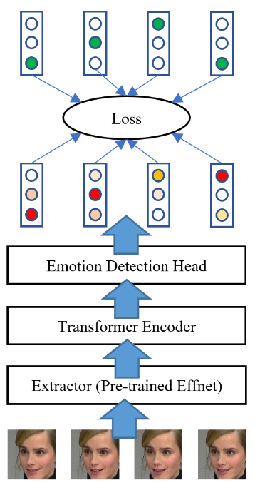

# ABAW5 Repo

## Introduction

5th Workshop and Competition on Affective Behavior Analysis in-the-wild ([ABAW5](https://ibug.doc.ic.ac.uk/resources/cvpr-2023-5th-abaw/))
Our report for the competition is [here](https://arxiv.org/abs/2303.09293)

# Dependency

We borrow EfficientNet of Savchenko, we must use the exact version of timm:
```
pip install timm==0.4.5
```

The pre-trained EfficientNet B0 on  Facial Behavior Tasks of Savchenko is in [this project](https://github.com/HSE-asavchenko/face-emotion-recognition)

# Model Architecture



## Result

Evaluation metrics on Aff-Wild2 Validation set
| Model | F1 |
| --- | --- |
| Effnet+MLP | 33.27 |
| Effnet+Transformer Encoder (N=4, h=4) | 36.15 |
| Effnet+Transformer Encoder (N=4, h=4), Augment (1) | 44.00 |
| Effnet+Transformer Encoder (N=4, h=8) , Augment (2) | 44.24 |
| Effnet+Transformer Encoder (N=6, h=4) , Augment (3) | **45.55** |
| Effnet+Transformer Encoder-Decoder, Augment | 39.72 |


Ensemble
| Model | F1 |
| --- | --- |
| Average Ensemble (1)(2) | 46.63 |
| Average Ensemble (1)(3) | 46.72 |
| Average Ensemble (3)(2) | 47.29 |
| Average Ensemble (1)(2)(3) | **47.75** |

